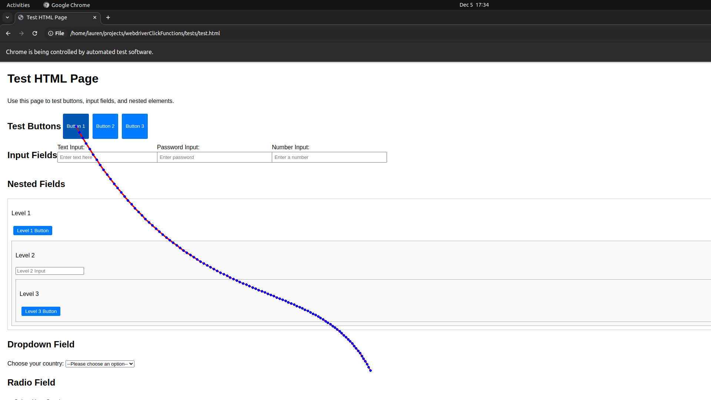
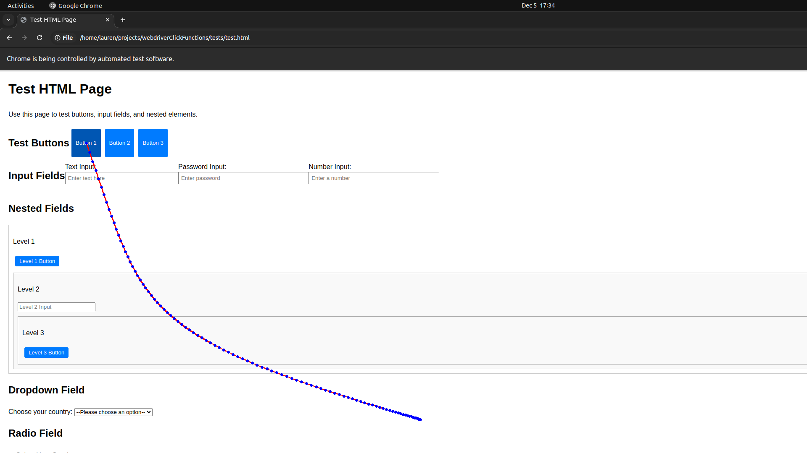
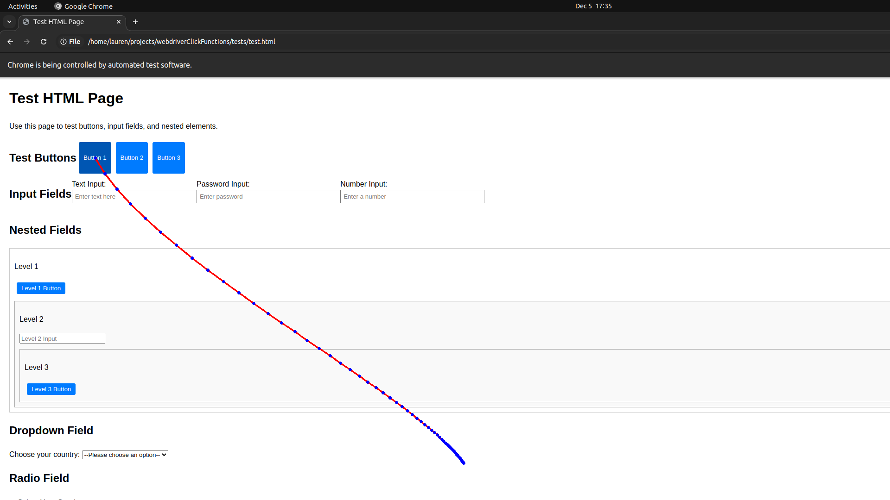
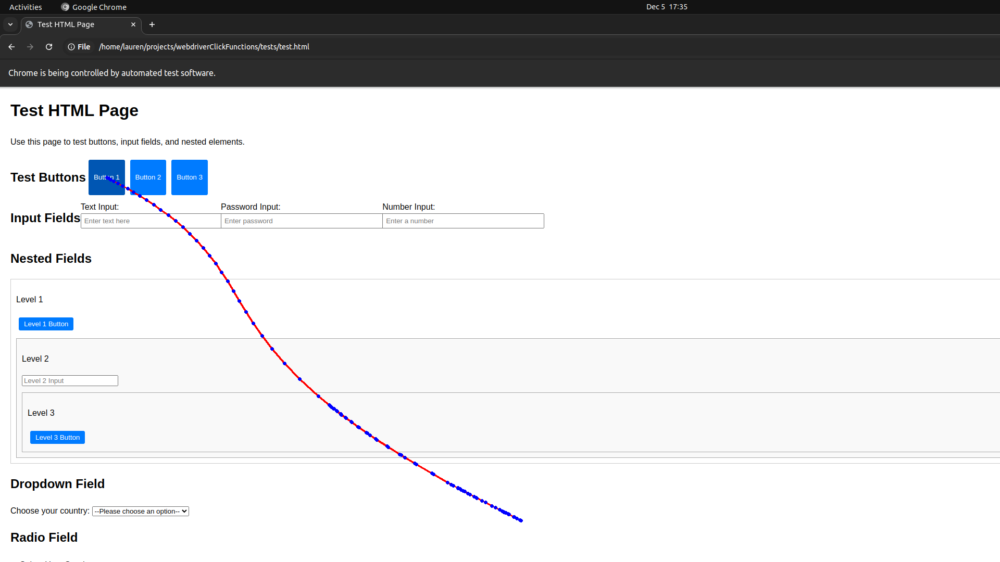

# WebDriver Click Functions

## Table of Contents

1. [Overview](#overview)
2. [Features](#features)
3. [Installation](#installation)
4. [Usage](#usage)
5. [Project Structure](#project-structure)
6. [Testing](#testing)
7. [Contributing](#contributing)
8. [License](#license)
9. [Contact](#contact)

## Overview

The WebDriver Click Functions project provides a set of utilities for performing advanced mouse and element interactions
using both Selenium and PyAutoGUI. It is designed to simulate human-like interactions with web elements and screen
coordinates, enhancing automation scripts with more natural movements.

## Features

- **Bezier Curve Mouse Movements**: Generate and use cubic Bezier curves for smooth, human-like mouse movements.
- **Image Recognition and Clicking**: Locate images on the screen and click within them using configurable confidence
  levels and retries.
- **Selenium Element Interactions**: Retrieve, save, and click on web elements using Selenium with enhanced accuracy.
- **Utility Functions**: Includes various helper functions for logging and element handling.

## Installation

1. Clone the repository:
   ```bash
   git clone https://github.com/reyuqt/webdriverClickFunctions.git
   ```
2. Navigate to the project directory:
   ```bash
   cd webdriverClickFunctions
   ```
3. Install the required dependencies:
   ```bash
   pip install -r requirements.txt
   ```

## Usage

- **Bezier Curve Mouse Movements**: Use the `click_with_bezier` function to move the mouse to a target location and
  click.
- **Image Recognition**: Use `locate_image` and `click_image` functions to interact with screen elements based on image
  recognition.
- **Selenium Interactions**: Use `get_element`, `save_element`, and `click_this_element` to interact with web elements.
- **Click Element**: high level function that combines functions from this project to click the desired element in
  selenium
  ``` 
  driver = webdriver.Chrome()

  selector = (By.ID, 'submit-button') # alternatively you can provide the element to click
  success = click_this_element(
    driver=driver,
    selector=selector,
    confidence=0.8, # Confidence level for image recognition
    retries=3, # Number of retries if the click fails
    x_reduction=0.2, # Reduction in the x-axis for click precision
    y_reduction=0.2, # Reduction in the y-axis for click precision
    duration_range=(1, 3), # Duration range for the click action
    steps_range=(150, 300) # Number of steps for mouse movement
    )```

### EASING
``` from webdriver_click_functions.easing import EASING_FUNCTIONS```
#### Linear Easing

#### Quad Easing


#### Quint Easing


#### Bounce Easing


### Click Verification
``` from webdriver_click_functions.selenium.confirm import Clicked```

there are a number of ways to verify that the element has been clicked I included some helper functions. Some of these include built in methods with selenium, or javascript injection. Alternatively, you can pass your own custom function that should return a bool wether the element was clicked or not.

## Project Structure

- **webdriver_click_functions/**: Contains the core functionality for mouse and element interactions.
    - `box.py`: Handles Bezier curve calculations.
    - `easing.py`: Provides easing functions for smooth transitions.
    - `mouse.py`: Manages mouse movements and clicks.
    - `screen.py`: Deals with screen interactions and image recognition.
    - `selenium/`: Contains utilities for Selenium interactions.
    - `utils.py`: Includes various helper functions.

- **tests/**: Contains unit tests for the project.
    - `test_box.py`, `test_draw.py`, `test_mouse.py`, etc.: Test files for respective modules.

- **visualizations/**: Used for visualizing data and interactions.

- **debug_scripts/**: Contains scripts for debugging purposes.

## Testing

To run the tests, use the following command:

```bash
pytest tests/
```

This will execute all the tests in the `tests/` directory.

## Contributing

Contributions are welcome! Please fork the repository and submit a pull request with your changes.

## License

This project is licensed under the MIT License.

## Contact

For questions or support, please contact Lauren at reyuqt01@gmail.com.
